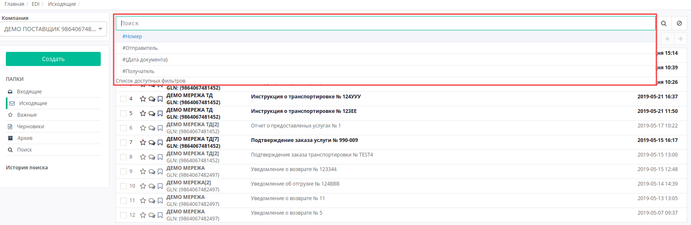

####################################################
Формирование документа «Уведомление об отгрузке» (DESADV) на платформе
####################################################

---------

.. contents:: Содержание:
   :depth: 6

---------

Введение
====================================

Данная инструкция описывает порядок формирования и отправки документа «**Уведомление об отгрузке**» (DESADV) на платформе EDI Network 2.0.
Уведомление об отгрузке - аналог товарно-транспортной накладной. В результате розничная сеть еще до прихода машины на рампу имеет точную информацию о поставке и данная информация уже загружена в учетную систему сети. 

Формирование Уведомления об отгрузке (DESADV)
===========================================================

Формирование документа возможно как на основании «**Заказа**», так и на основании «**Подтверждения заказа**».

Рассмотрим формирование «**Уведомления об отгрузке**» на основании «**Подтверждения заказа**».

Перейдите в раздел «**Исходящие**», выберите в необходимую сеть и тип документа «**Подтверждение заказа**». Для удобства воспользуйтесь поиском - достаточно ввести корректный номер документа в поле «Поиск», или часть номера GLN. Система автоматически выполнит поиск данного номера по GLN, по Отправителю, по Получателю и Дате документа.

В открытом документе, нажмите кнопку «**Сформировать**» и выберете из списка документ «**Уведомление об отгрузке**».

.. image:: pic_DESADV/DESADV_002.png
   :align: center

В окне появится **Форма** для заполнения необходимых реквизитов документа. Все поля, обозначены красной звёздочкой *** обязательны для заполнения**. Документ созданный на основе **Заказа** или **Подтверждения заказа** создастся автоматически, с уже заполненными обязательными полями.

#. **Получатель** - данные получателя (сети),компания
#. **УВЕДОМЛЕНИЕ ОБ ОТГРУЗКЕ №** - номер заказа 
#. **от** - дата уведомления об отгрузке, по умолчанию указана текущая дата
#. **Доставка будет произведена** - дата и время доставки
#. **Поставщик** - заполняется автоматически, или с помощью кнопки Поиск контрагента, или с помощью кнопки Указать себя 
#. **Место доставки** - заполняется автоматически, или с помощью кнопки Поиск контрагента, или с помощью кнопки Указать себя
#. **Покупатель** - заполняется автоматически, или с помощью кнопки Поиск контрагента, или с помощью кнопки Указать себя 

Ниже на странице созданного документа находится номер накладной, дополнительная информация по транспортировке, а также данные по количеству и итог по сумме с/без НДС по позициям:

.. image:: pic_DESADV/DESADV_004.png
   :align: center

.. important:: **Внимание!** Номер накладной должен полностью совпадать с номером оригинала бумажной накладной**.

А также перечень товарных позиций, которые были заказаны, и их поставляемое количество:

Система автоматически подставляет значения по позициям в колонку из ранее отправленного документа «**Подтверждение заказа**». Возможно вносить изменения в количество и цену позиций.

.. important:: **Внимание!** В случае создания нескольких расходных накладных на заказ, необходимо на каждую накладную сформировать уведомление об отгрузке. При этом, поле «Накладной» в документах должно отличаться.

Чтобы сформировать документ «**Уведомление об отгрузке**» из раздела просмотра документов, нажмите зеленую кнопку «**Создать**» и выберите тип документа «**Уведомление об отгрузке**» в появившемся окне **Создать документ**. Вид созданного документа соответствует документу «Уведомление об отгрузке» (DESADV) созданному на основе **Заказа** (**Подтверждения заказа**), однако все поля необходимо заполнить самостоятельно. В новом документе, все поля обозначенные красной звёздочкой *** обязательны для заполнения**.

.. image:: pic_DESADV/DESADV_006.png
   :align: center

Редактирование товарных позиций
=====================================================

В случае, если вам необходимо изменить количество поставляемого товара, в колонке «**Поставляемое количество**», измените количество.

.. important:: **Внимание!** Поставляемое количество товарных позиций не может превышать указанное в заказе!

Если какая-то из позиций отсутствует и поставляться не будет, в колонке «**Поставляемое количество**», укажите 0. Если изменилась цена, внесите изменения в колонку «**Цена с НДС**».
Все изменения отобразятся в блоке **Итого**:

- **Количество позиций**
- **Поставляемое количество**
- **Сумма без НДС**
- **Сумма с НДС**
- **Всего налогов**

После внесения всех данных в документе, нажмите кнопку «**Сохранить**», затем «**Отправить**»

Отправленный документ автоматически попадает в папку «**Исходящие**» и будет находится в цепочке документов вместе с заказом и подтверждением заказа.

.. include:: kontakti.rst
