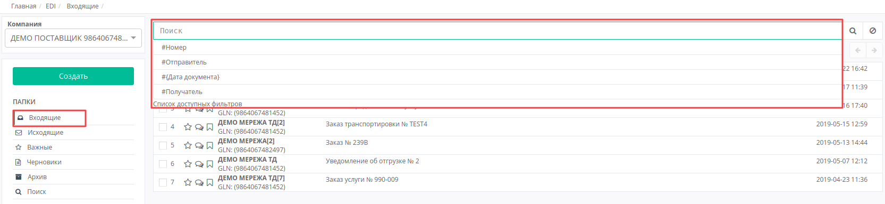
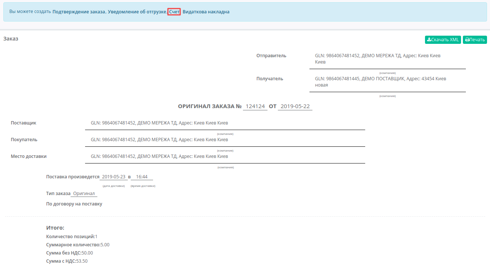
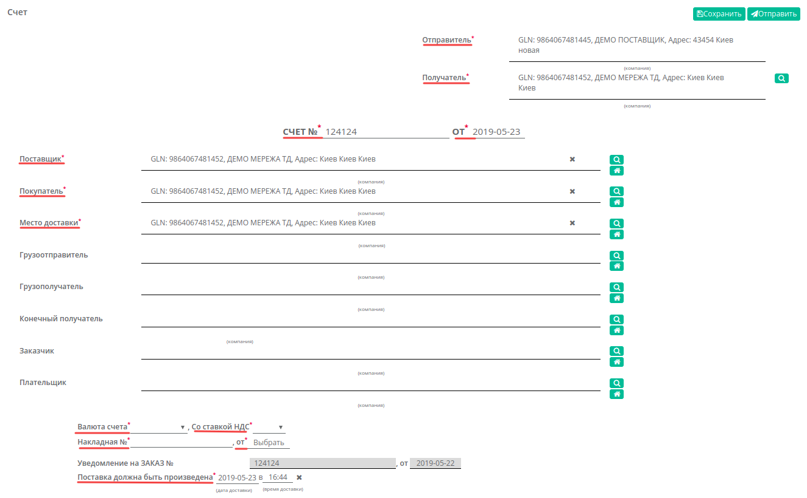
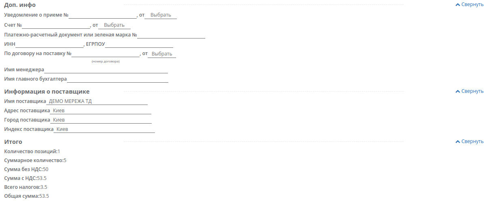
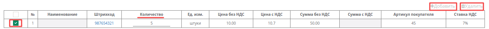
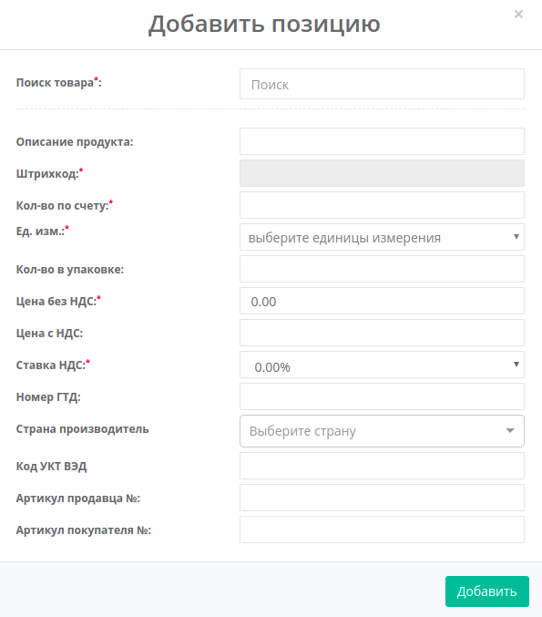

##############################################################################
Формирование и отправка документа «Счет» (INVOICE)на web-платформе
##############################################################################
---------

.. contents:: Содержание:
   :depth: 6

---------

Введение
====================================
Данная инструкция описывает порядок формирования и отправки документа «**Счет фактура**» (INVOICE).
| INVOICE - счет на оплату, отправляется в розничную сеть поставщиком для окончательного согласования цен.

Формирование документа «Счет фактура»
====================================

Создание документа происходит на основании «**Заказа**».

Перейдите в раздел «**Входящие**», выберите необходимую сеть и тип документа «Заказ». Для удобства воспользуйтесь поиском - достаточно ввести корректный номер документа в поле «Поиск», или часть номера GLN. Система автоматически выполнит поиск данного номера по GLN, по Отправителю, по Получателю и Дате документа.

В открытом документе, на форме-подсказке, которая позволяет создать документ на основе Заказа, выберите из списка  «**Счет**».

Документ созданный на основе Заказа или Подтверждения заказа создастся автоматически, с уже заполненными полями Отправителя и получателся. Все поля, обозначены красной звёздочкой *** обязательны для заполнения**.

.. important:: **Внимание!** Номер накладной должен полностью совпадать с номером оригинала бумажной накладной.

#. **Отправитель** - данные отправителя счета (поставщика)
#. **Получатель** - данные получателя (сети),компания
#. **СЧЕТ №** - номер счета 
#. **от** - дата уведомления об отгрузке, по умолчанию указана текущая дата
#. **Поставщик** - заполняется автоматически, или с помощью кнопки Поиск контрагента, или с помощью кнопки Указать себя 
#. **Покупатель** - заполняется автоматически, или с помощью кнопки Поиск контрагента, или с помощью кнопки Указать себя
#. **Место доставки** - заполняется автоматически, или с помощью кнопки Поиск контрагента, или с помощью кнопки Указать себя
#. **Валюта счета** - выбрать валюту: Гривна, Доллар США, Евро
#. **Со ставкой НДС** - выбрать ставку налога на добавленную стоимость: 0%, 7%, 20%
#. **Накладная №** - номер накладной должен полностью совпадать с номером оригинала бумажной накладной
#. **от** - дата накладной
#. **Поставка должна быть произведена** - дата и время доставки

.. important:: **Внимание!** В случае создания нескольких расходных накладных, необходимо на каждый заказ сформировать счет фактуру. При этом, поле «**По накладной №**» в документах должно отличаться.

Ниже на странице созданного документа находится необязательная для заполнения (если другое не указано в договоре) дополнительная информация о поставщике, № Уведомления о приеме, № Счета, № договора на поставку, а также итог по количеству позициям и по сумме с/без НДС:

Ниже на странице созданного документа находится перечень товарных позиций, которые были заказаны, и их количество. Система автоматически подставляет значения в колонку «**Количество**» из ранее присланного документа «**Заказ**».

Редактирование товарных позиций
====================================

В случае, если вам необходимо изменить количество поставляемого товара, в колонке «**Количество**», внесите необходимое значение.

.. important:: **Внимание!** Поставляемое количество товарных позиций не может превышать указанное в заказе!

Если какая-то из позиций отсутствует и поставляться не будет, её необходимо отметить галочкой и удалить. Возможно также добавить другую позицию из Товарного справочника, запонив форму **Добавить позицию** под кнопкой **Добавить**.

После внесения всех данных в документе, нажмите кнопку «**Сохранить**», затем «**Отправить**»

.. image:: pic_ORDRSP/ORDRSP_013.png
   :align: center

Отправленный документ автоматически попадает в папку «**Отправленные**» и будет находится в цепочке документов вместе с заказом и подтверждением заказа.

.. include:: kontakti.rst
