####################################################
Формирование и отправка документа «Подтверждение заказа» (ORDRSP) на платформе EDI Network 2.0
####################################################
---------

.. contents:: Содержание:
   :depth: 6

---------

Введение
====================================
Данная инструкция описывает порядок формирования и отправки документа «**Подтверждение заказа**» (**ORDRSP**).

Формирование ORDRSP в ответ на входящий Заказ
==================================================================

Чтобы сформировать «**Подтверждение заказа** (**ORDRSP**)» на основании входящего **Заказа** (ORDER), у вас должен быть заказ в папке «**Входящие**».

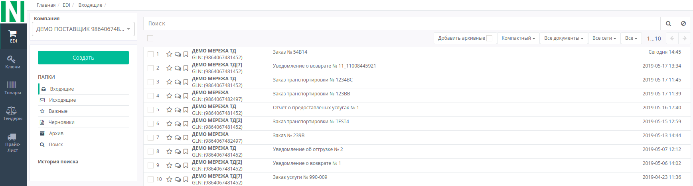
   
Для этого зайдите в папку «**Входящие**» и выберите необходимый **Заказ**. Для поиска достаточно ввести корректный номер документа в поле «Поиск». Документы также возможно искать по Отправителю, Дате документа и Получателю.

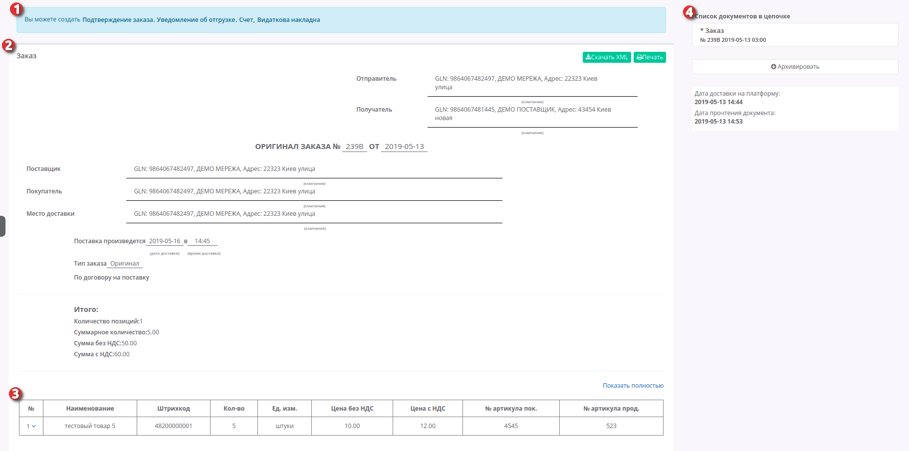

Откройте подходящий Заказ. Он состоит из основных информационных блоков:

1. Форма, которая позволяет создать документ на основе заказа - Подтверждение заказа,Уведомление об отгрузке, Счет, Видаткова накладна
2. Форма заказа с заполненными полями, информация перенесется в документ созданный на основе заказа
3. Информация по товарным позициям
4. Список документов в цепочке

Для формирования ORDRSP выберите «**Подтверждение заказа**» на форме №1. Документ создастся автоматически, с уже заполненными обязательными полями.

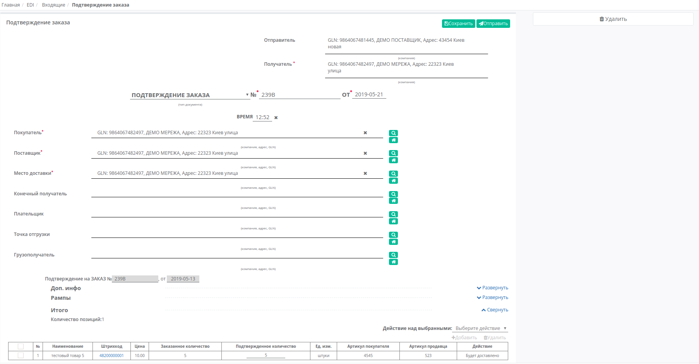

|**Получатель** - данные получателя (сети),компания
|**Подтверждение заказа** - поле "Тип документа" 
|**№** - номер заказа
|**от** - дата подтверждения, по умолчанию указана текущая дата

Поле "Тип документа" можно изменить нажав на название типа, и вместо Подтверждение заказа, выбрать Замена или Удаление подтверждения заказа.

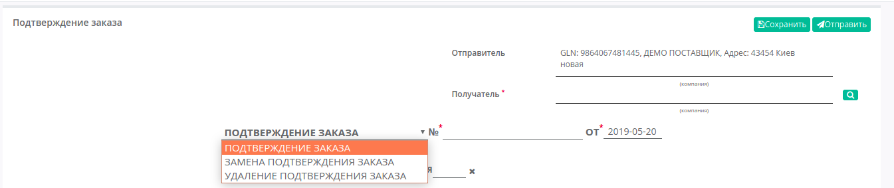

|**Покупатель** - заполняется автоматически, или с помощью кнопки Поиск контрагента, или с помощью кнопки Указать себя
|**Поставщик** - автоматически, или с помощью кнопки Поиск контрагента, или с помощью кнопки Указать себя
|**Место доставки** - автоматически, или с помощью кнопки Поиск контрагента, или с помощью кнопки Указать себя

В блоках **Доп инфо**, **Рампы** и **Позиции** отображается дополнительная информация по отгрузке, информация о позициях, а также возможны действия по добавлению позиций и точек отгрузки.

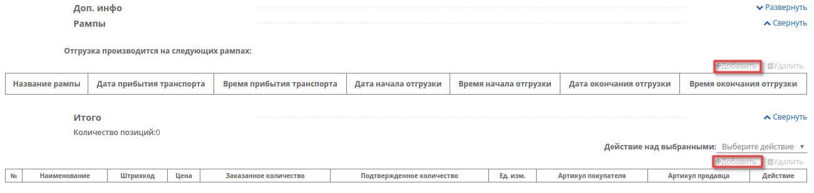

Блок **Доп инфо** заполнять необязательно, в нем отображаются дополнительная информация:
Документ осведомляет что поставка изменена; поставка принята; поставка не принята;
Подтвержденная дата доставки; Дата отгрузки; Валюта (Гривна, Доллар США, Евро); номер договора и условия транспортировки.

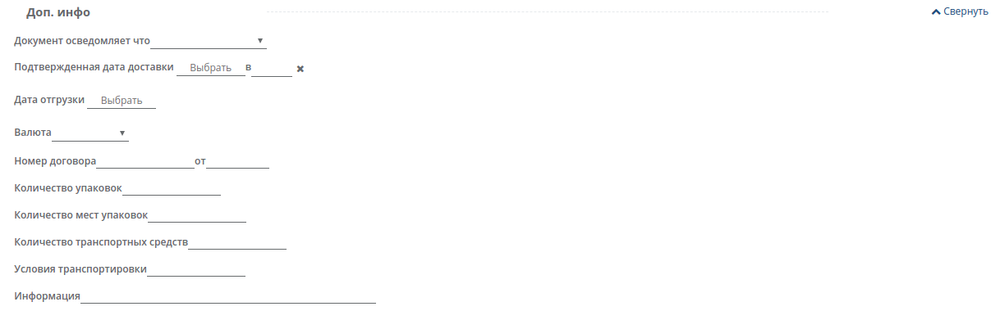

Блок **Рампы** заполняется информацией об условиях отгрузки и точке отгрузке.

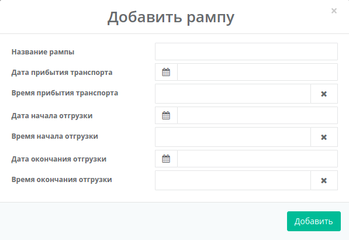

Ниже на странице созданного документа находится таблица-перечень заказаных **товарных позиций**, основная информация, а также возможность добавить или изменить позицию. 

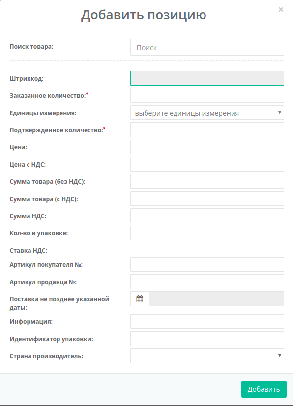

Формирование нового ORDRSP
==================================================================

Чтобы сформировать документ «**Подтверждение заказа**» (**ORDRSP**), из раздела «**Входящие**», нажмите зеленую кнопку «**Создать**» и выберите тип документа «**Подтверждение заказа**» в появившемся окне **Создать документ**.

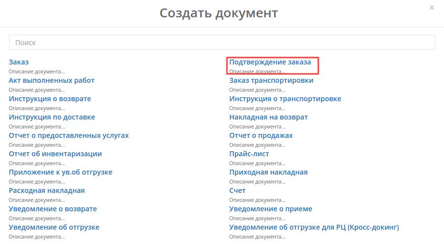

Вид созданного документа соответствует документу «**Подтверждение заказа**» (**ORDRSP**) созданному на основе заказа, однако все поля необходимо заполнить самостоятельно.
В новом документе, все поля обозначенные красной звёздочкой ***** **обязательны для заполнения**.

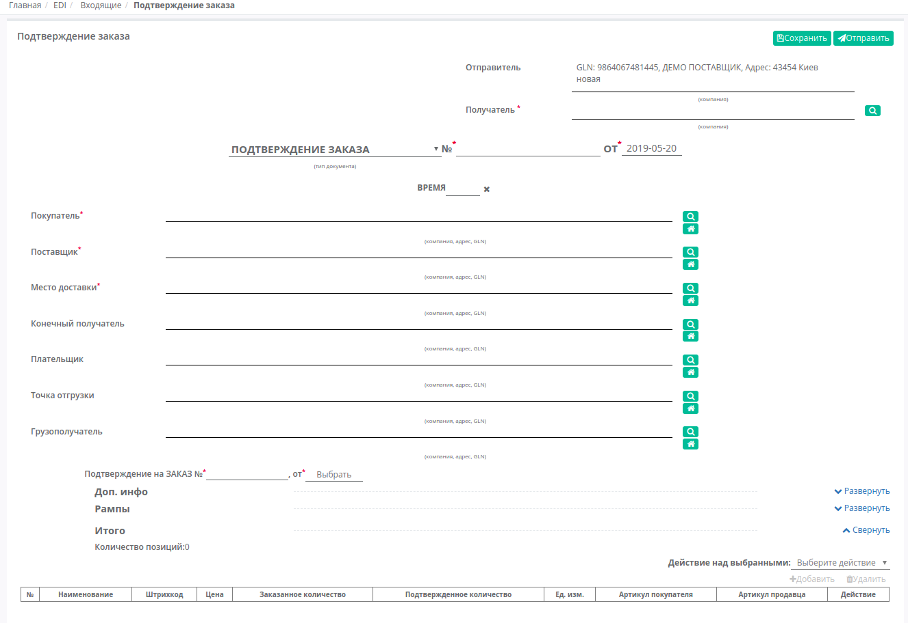

**Получатель** - необходимо заполнить с помощью кнопки **Поиск контрагента** (лупа) или же с помощью кнопки **Указать себя** (дом).
Форма **Поиск контрагента** дает возможность искать по GLN, ИНН, по названию компании или по названии сети (при выборе соответсвующего чекера).

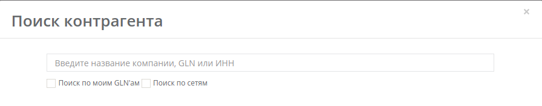

|Поля **№** и **Дата** также являются обязательными, поле "Время"" - опционально.
|**Покупатель** - заполняется с помощью кнопки Поиск контрагента, или с помощью кнопки Указать себя
|**Поставщик** - заполняется с помощью кнопки Поиск контрагента, или с помощью кнопки Указать себя
|**Место доставки** - заполняется с помощью кнопки Поиск контрагента, или с помощью кнопки Указать себя
|**Подтверждение на ЗАКАЗ №** - номер заказа**от** - дата 

Редактирование товарных позиций
================================================

Поставщик может редактировать позиции, например, в случае когда необходимо изменить количество подтвержденного товара. Для этого внесите количество подтверждаемого товара в поле **Подтвержденное количество**.

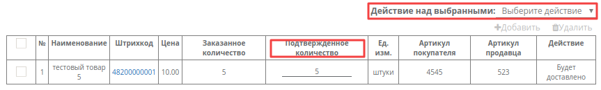

Возможны следующие «**Действие над выбранными**» позициями: **Будет доставлено** или **Отказано**.

В поле **Действия** - отображается статус действия в выбранной позицией. Возможны следующие статусы: **Будет доставлено, Изменения количества, или Отказано**

|Если при выборе позиции (с помощью чекера) выбрать **Будет доставлено** без изменений в позиции,соответствующий статус проставится в поле Действия.
|Если изменить количество подтвержденного товара в поле Подтвержденное количество статус изменится на **Изменение кол-ва**.
|Если какая-то из позиций отсутствует и поставляться не будет, выберите действие **Отказано**, соответствующий статус проставится в поле Действия, и значение в колонке Подтвержденное количество автоматически будет изменено на "0".

.. important:: **Внимание!** Подтвержденное количество товарных позиций не может превышать указанное в заказе!

После внесения всех данных в документе, нажмите кнопку «**Сохранить**», затем «**Отправить**»

Отправленный документ автоматически попадает в папку «**Отправленные**» и будет находится в цепочке документов вместе с заказом.
