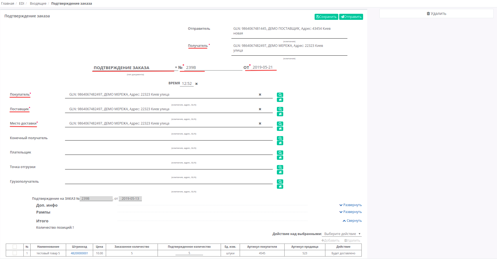

####################################################
Формирование и отправка документа «Подтверждение заказа» (ORDRSP) на платформе EDI Network 2.0
####################################################

.. role:: red
---------

Введение
====================================
Данная инструкция описывает порядок формирования и отправки документа «**Подтверждение заказа**» (**ORDRSP**).
Поставщик на основании полученного заказа формирует документ ORDRSP, в котором подтверждает или не подтверждает поставку той или иной позиции продукции. Поставщик может изменить количество поставляемого товара (например, в зависимости от кратности упаковки, остатков на складе и т.д.).

Формирование ORDRSP в ответ на входящий Заказ
==================================================================

Чтобы сформировать «**Подтверждение заказа** (**ORDRSP**)» на основании **Заказа** (ORDER), войдите в папку «**Входящие**» и выберите **заказ**, по которому нужно сделать подтверждение.

.. image:: pic_DESADV/DESADV_001.png
   :align: center
   
Для поиска достаточно ввести корректный номер документа в поле «Поиск». Документы также возможно искать по Отправителю, Дате документа и Получателю.

.. image:: pic_ORDRSP/ORDRSP_014.png
   :align: center

Для формирования ORDRSP выберите «**Подтверждение заказа**» на форме-подсказке, документ создастся автоматически.
Из Заказа заполненные поля переносяться в «**Подтверждение заказа**». Все поля, обозначены красной звёздочкой *** обязательны для заполнения**.

1. **Получатель** - данные получателя (сети),не подлежат редактированнию
2. **Подтверждение заказа** - поле «**Тип документа**»
3. **№** - номер заказа
4. **от** - дата подтверждения, по умолчанию указана текущая дата
5. **Покупатель** - заполняется автоматически, или с помощью кнопки Поиск контрагента, или с помощью кнопки Указать себя
6. **Поставщик** - автоматически, или с помощью кнопки Поиск контрагента, или с помощью кнопки Указать себя
7. **Место доставки** - автоматически, или с помощью кнопки Поиск контрагента, или с помощью кнопки Указать себя

Поле «**Тип документа**» можно изменить нажав на название типа, и вместо Подтверждение заказа, выбрать Замена или Удаление подтверждения заказа.

.. image:: pic_ORDRSP/ORDRSP_004.png
   :align: center

| Ниже необязательные блоки **Доп инфо**, **Рампы**, **Итого**.
| В блоке  **Позиции** отображается таблица-перечень заказаных **товарных позиций** и основная информация по позициям.
**Товарные позиции** переносятся с Заказа, их можно подтвердить, удалить, изменить.

:red:`*Все изменения только после согласования с сетью!*`

Возможны следующие «**Действие над выбранными**» позициями: **Будет доставлено** или **Отказано**.
В колонке **Действия** - отображается статус действия в выбранной позицией. Возможны следующие статусы: **Будет доставлено, Изменения количества, или Отказано**

| Если при выборе позиции (с помощью чекера) выбрать **Будет доставлено** без изменений в позиции,соответствующий статус проставится в поле Действия.
| Если изменить количество подтвержденного товара в поле Подтвержденное количество статус изменится на **Изменение кол-ва**.
| Если какая-то из позиций отсутствует и поставляться не будет, выберите действие **Отказано**, соответствующий статус проставится в поле Действия, и значение в колонке Подтвержденное количество автоматически будет изменено на «0».

.. image:: pic_ORDRSP/ORDRSP_012.png
   :align: center
   
Поставщик может редактировать позиции, например, в случае когда необходимо изменить количество подтвержденного товара. Для этого внесите количество подтверждаемого товара в колонке **Подтвержденное количество**.
Если какая-то из позиций отсутствует и поставляться не будет, её необходимо отметить галочкой и удалить. 

Возможно также добавить другую позицию из Товарного справочника, заполнив форму **Добавить позицию** под кнопкой **Добавить**.

.. important:: **Внимание!** Подтвержденное количество товарных позиций не может превышать указанное в заказе!

После внесения всех данных в документе, нажмите кнопку «**Сохранить**», затем «**Отправить**».

.. image:: pic_ORDRSP/ORDRSP_013.png
   :align: center

Отправленный документ автоматически попадает в папку «**Отправленные**» и будет находится в цепочке документов вместе с заказом.

Формирование нового ORDRSP
==================================================================

Чтобы сформировать документ «**Подтверждение заказа**» (**ORDRSP**), из раздела «**Входящие**», нажмите зеленую кнопку «**Создать**» и выберите тип документа «**Подтверждение заказа**» в появившемся окне **Создать документ**.

Вид созданного документа соответствует документу «**Подтверждение заказа**» (**ORDRSP**) созданному на основе заказа, однако все поля необходимо заполнить самостоятельно.
В новом документе, все поля обозначенные красной звёздочкой ***** **обязательны для заполнения**.

.. image:: pic_ORDRSP/ORDRSP_010.png
   :align: center

**Получатель** - необходимо заполнить с помощью кнопки «**Поиск контрагента**» (лупа) или же с помощью кнопки «**Указать себя**» (дом).
Форма **Поиск контрагента** дает возможность искать по GLN, ИНН, по названию компании или по названии сети (при выборе соответсвующего чекера).

| Поля **№** и **Дата** также являются обязательными, поле «Время» - опционально.
| **Покупатель** - заполняется с помощью кнопки Поиск контрагента, или с помощью кнопки Указать себя
| **Поставщик** - заполняется с помощью кнопки Поиск контрагента, или с помощью кнопки Указать себя
| **Место доставки** - заполняется с помощью кнопки Поиск контрагента, или с помощью кнопки Указать себя
| **Подтверждение на ЗАКАЗ №** - номер заказа
| **от** - дата 

.. image:: pic_ORDRSP/ORDRSP_005.png
   :align: center

Блок **Доп инфо** заполнять необязательно, в нем отображаются дополнительная информация:
Документ осведомляет что поставка изменена; поставка принята; поставка не принята;
Подтвержденная дата доставки; Дата отгрузки; Валюта (Гривна, Доллар США, Евро); номер договора и условия транспортировки.

.. image:: pic_ORDRSP/ORDRSP_006.png
   :align: center

Блок **Рампы** заполняется информацией об условиях отгрузки и точке отгрузки.

